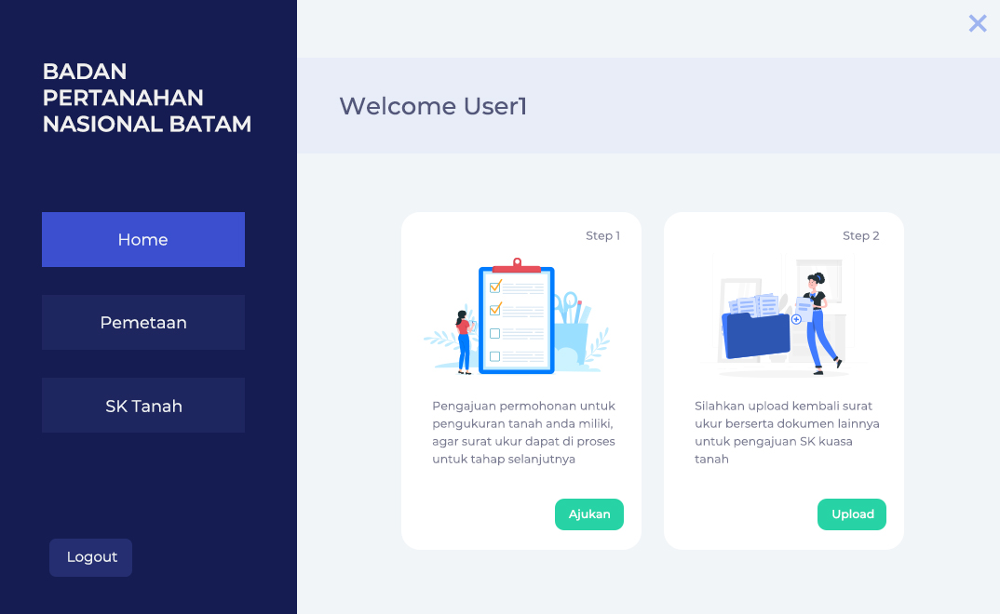
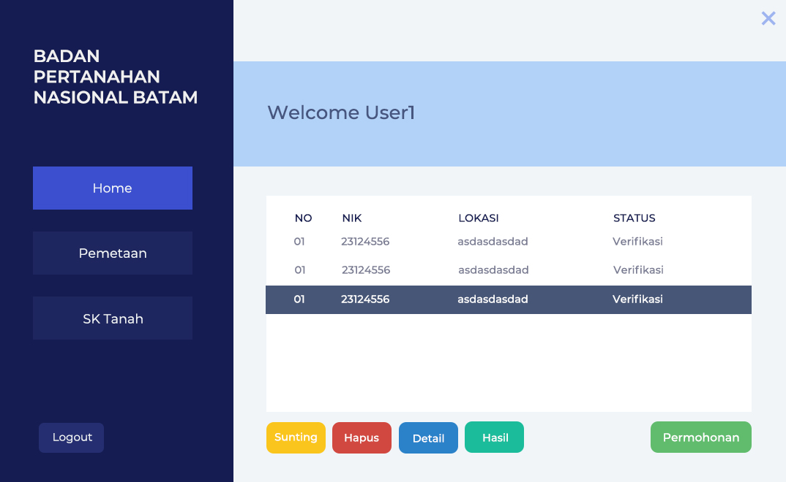

# Aplikasi-Pengukuran-Tanah
Aplikasi Permintaan Pengukuran Tanah Badan Pertanahan Nasional Batam
dibuat untuk project base learning kampus yang berbasis desktop software. Menggunkan java sebagai bahasa pemrograman dan netbeans sebagai code editor

